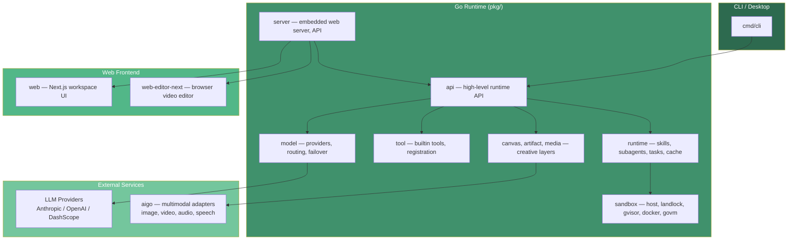

# Saker

[](https://github.com/cinience/saker/actions/workflows/ci.yml)
[](https://github.com/cinience/saker/actions/workflows/codeql.yml)
[](https://goreportcard.com/report/github.com/cinience/saker)
[](LICENSE)
[](https://codecov.io/gh/cinience/saker)

Saker is a source-available creative agent runtime. It combines a Go agent backend,
a web workspace, and a browser video editor so a single project can move from
prompting and planning to media generation, review, and automation.

[中文](README_zh.md)

## Architecture



## What It Includes

| Area | Description |
| --- | --- |
| Agent runtime | CLI, streaming runs, skills, subagents, memory, hooks, model routing, MCP, and sandbox backends. |
| Creative workspace | Next.js web UI for chat, canvas-style creative work, assets, and project state. |
| Video editor | Static-exported browser editor mounted at `/editor/` in the embedded server. |
| Multimodal tools | Image, video, audio, speech, transcription, and media intelligence adapters through `aigo`. |
| Developer surfaces | Go SDK, HTTP/server mode, examples, integration tests, eval harnesses, Docker. |

## Requirements

- Go 1.26 or newer
- Node.js 22 or newer
- npm
- Optional: Docker for e2e and sandbox-related tests

## Quick Start

Install frontend dependencies once:

```bash
cd web && npm ci
cd ../web-editor-next && npm ci
cd ..
```

Build and run the full embedded server:

```bash
make run
```

The command builds `web`, builds `web-editor-next`, embeds both static bundles
into the Go binary, and starts the server on `http://localhost:10112`.

Build only the CLI/backend:

```bash
make saker
./bin/saker --version
```

Run a one-shot prompt:

```bash
export ANTHROPIC_API_KEY=sk-ant-...
./bin/saker --print "Draft a 30-second product video concept"
```

Run local frontend development servers:

```bash
make web-dev          # http://localhost:10111
make web-editor-dev   # editor app development server
```

## Configuration

Saker keeps project-local runtime state in `.saker/`, which is ignored by git.

Common environment variables:

```bash
ANTHROPIC_API_KEY=
OPENAI_API_KEY=
DASHSCOPE_API_KEY=
SAKER_MODEL=claude-sonnet-4-5-20250929
```

Copy `.env.example` for local development if you prefer dotenv-style setup.

Server auth can be configured with:

```bash
./bin/saker --auth-user admin --auth-pass '<password>'
./bin/saker --server
```

## Repository Layout

```text
saker/
├── cmd/                 # CLI, embedded web server, desktop entry
├── pkg/                 # Go runtime, tools, server, model providers, media, sandbox
├── web/                 # Main Next.js web workspace
├── web-editor-next/     # Browser video editor mounted at /editor/
├── examples/            # SDK, CLI, HTTP, hooks, multimodel, pipeline examples
├── test/                # Integration and pipeline tests
├── e2e/                 # Docker-based end-to-end suites
├── eval/                # Evaluation harnesses
├── skills/              # Built-in skills
├── docs/                # Stable open-source project documentation
```

## Development

Useful commands:

```bash
make test-short
make test-unit
make test-pipeline
make server-dev
make server
```

Frontend checks:

```bash
cd web && npm run test && npm run build
cd ../web-editor-next && npm run build
```

The full production build is:

```bash
make build
```

## Documentation

- [Project overview](docs/overview.md)
- [Development guide](docs/development.md)
- [Configuration](docs/configuration.md)
- [Deployment guide](docs/deployment.md)
- [Security policy](../SECURITY.md)
- [Security model](docs/security.md)
- [API reference](docs/api-reference.md)
- [Third-party notices](docs/third-party-notices.md)
- [Roadmap](ROADMAP.md)
- [Changelog](CHANGELOG.md)

## License Notes

Saker is licensed under the **Saker Source License Version 1.0 (SKL-1.0)** — a source-available license based on Apache 2.0 with additional terms.

**Key points:**

- **Free for small teams and individuals** — organizations with annual gross revenue ≤ 1,000,000 CNY (~$140,000 USD) AND ≤ 100 registered users may use this software in production without restriction.
- **Commercial license required** — if your annual gross revenue exceeds 1,000,000 CNY (~$140,000 USD) OR your registered user count exceeds 100, you must obtain a commercial license before production use. Contact: cinience@hotmail.com
- **Non-production use is always free** — evaluation, testing, development, personal learning, and research are permitted regardless of revenue.
- **Attribution required for derivative works** — if you build upon this project, you must display "Powered by Saker.cc" in your user interface and documentation.

Upstream notices are maintained in `NOTICE`, and dependency/asset license inventory is maintained in [docs/third-party-notices.md](docs/third-party-notices.md).

The browser editor under `web-editor-next/` contains MIT-licensed code derived from OpenCut. Its asset notes live in `web-editor-next/ASSET_LICENSES.md`.

The `godeps` packages (aigo, goim, govm) are remote Go modules resolved
through `go.mod`, not local in-tree directories.

## Contributing

Issues and pull requests are welcome. Before submitting changes, run the checks
for the area you touched and include any relevant setup notes in the pull
request.
