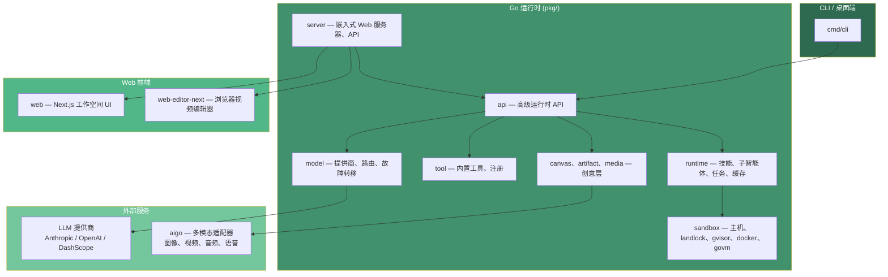

# Saker

<p align="center">
  
  
  
  <br>
  <a href="https://github.com/cinience/saker/actions/workflows/ci.yml"></a>
  <a href="https://github.com/cinience/saker/actions/workflows/codeql.yml"></a>
  <a href="https://goreportcard.com/report/github.com/cinience/saker"></a>
  <a href="https://codecov.io/gh/cinience/saker"></a>
</p>

<p align="center">
  <b>开源创意智能体运行时</b><br>
  <span style="color: #666;">从灵感到成品，一站式 AI 驱动创作平台</span>
</p>

<p align="center">
  <a href="#-快速开始">快速开始</a> •
  <a href="#-功能特性">功能特性</a> •
  <a href="#-文档">文档</a> •
  <a href="#-开发">开发</a> •
  <a href="#-许可证">许可证</a> •
  <a href="README_zh.md">中文</a>
</p>

---

## 📖 简介

**Saker** 是一个源代码开放的创意智能体运行时，将 Go 后端运行时、Web 工作空间和浏览器视频编辑器整合为一个统一的创作平台。

无论是构思视频概念、生成多媒体内容，还是协作审查和自动化流程，Saker 都能在一个项目中完成从提示到成品的全流程。

```
┌─────────────┐     ┌─────────────┐     ┌─────────────┐
│   提示与规划  │ ──▶ │ 媒体生成    │ ──▶ │ 审查与自动化 │
└─────────────┘     └─────────────┘     └─────────────┘
        │                    │                    │
        ▼                    ▼                    ▼
   ┌─────────────────────────────────────────────────────┐
   │              Saker 创意智能体运行时                  │
   │  ┌──────────┐  ┌──────────┐  ┌──────────────────┐  │
   │  │ Go 后端  │  │ Web 界面 │  │ 浏览器视频编辑器  │  │
   │  └──────────┘  └──────────┘  └──────────────────┘  │
   └─────────────────────────────────────────────────────┘
```

## 🚀 快速开始

### 环境要求

- Go 1.26 或更高版本
- Node.js 22 或更高版本
- npm
- Docker（可选，用于沙箱和端到端测试）

### 安装与运行

```bash
# 1. 克隆仓库
git clone https://github.com/cinience/saker.git
cd saker

# 2. 安装前端依赖
cd web && npm ci
cd ../web-editor-next && npm ci
cd ..

# 3. 构建并运行（包含嵌入式前端）
make run
```

服务将在 `http://localhost:10112` 启动。

### 使用 CLI

```bash
# 构建 CLI
make saker

# 配置 API 密钥
export ANTHROPIC_API_KEY=sk-ant-...

# 运行单次提示
./bin/saker --print "创作一个 30 秒的产品视频概念"
```

### 开发模式

```bash
# 独立前端开发服务器
make web-dev          # http://localhost:10111
make web-editor-dev   # 编辑器开发服务器
```

## ✨ 功能特性

### 🧠 智能体运行时

| 特性 | 描述 |
|------|------|
| **核心循环** | 可配置的迭代工具调用循环，支持超时和停止原因分类 |
| **预算保护** | 累计成本或 Token 数超限时自动终止 |
| **重复检测** | 检测到相同连续工具调用时自动终止，支持自我修正提示 |
| **SSE 流式** | Anthropic 兼容的 SSE 协议，支持智能体专用事件扩展 |
| **会话管理** | 默认支持 1000 个并发会话，带生命周期追踪 |
| **上下文压缩** | 提示摘要和历史剪枝（compact & microcompact） |
| **配置隔离** | 命名配置实现设置、内存和历史的完全隔离 |

### 🤖 模型与路由

| 特性 | 描述 |
|------|------|
| **多提供商** | Anthropic、OpenAI、DashScope 支持 |
| **故障转移** | 多模型故障转移，支持指数退避和流缓冲 |
| **智能路由** | 基于提示复杂度的成本感知模型选择 |
| **速率限制** | 按提供商跟踪速率限制头，HTTP 传输包装器 |
| **提示缓存** | 系统和最近消息的提示缓存支持 |

### 🛠️ 工具系统（37+ 内置工具）

<details>
<summary><b>展开查看工具分类</b></summary>

| 分类 | 工具 |
|------|------|
| 文件操作 | Read, Write, Edit, Glob, Grep, ImageRead |
| Shell | Bash, BashOutput, BashStatus |
| Web | WebFetch, WebSearch, Webhook（SSRF 安全） |
| 交互 | AskUserQuestion, Skill, SlashCommand |
| 内存 | MemorySave, MemoryRead |
| 画布 | CanvasGetNode, CanvasListNodes, CanvasTableWrite |
| 任务 | TaskCreate, TaskGet, TaskList, TaskUpdate, KillTask, TodoWrite |
| 视频媒体 | AnalyzeVideo, VideoSampler, VideoSummarizer, FrameAnalyzer, MediaIndex, MediaSearch |
| 流处理 | StreamCapture, StreamMonitor |
| 浏览器 | Browser, Aigo（YAML 驱动） |

</details>

### 🔒 沙箱与安全

| 特性 | 描述 |
|------|------|
| **5 种沙箱后端** | Host、Landlock (LSM)、gVisor (runsc)、Docker（禁用网络）、GoVM（轻量级 VM） |
| **SSRF 防护** | 拦截本地主机、私有 IP、元数据 IP；DNS 错误时安全关闭 |
| **泄露检测** | 基于正则的密钥扫描，支持严重级别、掩码和清理 |
| **权限矩阵** | 来自 permissions.json 的每工具规则（允许/拒绝/询问） |

### 🎨 画布与媒体

- **画布文档**：节点、边（流/引用/上下文）、视口 JSON 表示
- **画布执行器**：拓扑 DAG 遍历，将生成节点分派到运行时
- **40+ 节点类型**：Agent、AI、Audio、Composition、Export、ImageGen、LLM、Mask、Prompt、VideoGen、VoiceGen 等
- **媒体索引**：支持关键帧和 Chromem 嵌入的可搜索索引
- **视频分析**：帧采样、摘要、内容描述

### 🎬 浏览器视频编辑器

| 特性 | 描述 |
|------|------|
| **时间轴** | 多轨道布局，支持音频、视频、文本、特效轨道 |
| **动画** | 基于关键帧的动画，支持贝塞尔曲线和插值 |
| **特效系统** | 注册表、组件、参数通道动画 |
| **字幕** | ASS/SRT 解析、构建和插入 |
| **转录** | 基于 LLM 的音频转录和诊断 |
| **预览与引导** | 渲染覆盖、缩放、点击测试、网格和对齐 |
| **WASM 处理** | 通过 WebAssembly 在浏览器端渲染媒体 |
| **撤销/重做** | 命令模式，支持剪贴板操作 |

## 📚 文档

| 文档 | 描述 |
|------|------|
| [项目概览](docs/overview.md) | 系统架构和设计概览 |
| [开发指南](docs/development.md) | 本地开发和贡献指南 |
| [配置说明](docs/configuration.md) | 详细配置选项 |
| [部署指南](docs/deployment.md) | 生产环境部署 |
| [安全策略](../SECURITY.md) | 安全报告和政策 |
| [安全模型](docs/security.md) | 安全架构详解 |
| [API 参考](docs/api-reference.md) | REST API 文档 |
| [第三方声明](docs/third-party-notices.md) | 依赖许可清单 |
| [路线图](ROADMAP.md) | 项目发展规划 |
| [更新日志](CHANGELOG.md) | 版本更新记录 |

## 🏗️ 架构



## 🗂️ 项目结构

```
saker/
├── cmd/                 # CLI、嵌入式 Web 服务器、桌面入口
├── pkg/                 # Go 运行时、工具、服务器、模型提供商、媒体、沙箱
├── web/                 # 主 Next.js Web 工作空间
├── web-editor-next/     # 浏览器视频编辑器，挂载于 /editor/
├── examples/            # SDK、CLI、HTTP、钩子、多模型、管道示例
├── test/                # 集成和管道测试
├── e2e/                 # 基于 Docker 的端到端测试套件
├── eval/                # 评估框架
├── skills/              # 内置技能
└── docs/                # 稳定开源项目文档
```

## 💻 开发

### 常用命令

```bash
# 测试
make test-short       # 快速测试
make test-unit        # 单元测试
make test-pipeline    # 管道测试

# 开发服务器
make server-dev       # 开发服务器
make server           # 生产服务器

# 完整构建
make build            # 生产构建
```

### 前端检查

```bash
cd web && npm run test && npm run build
cd ../web-editor-next && npm run build
```

## 🔑 配置

Saker 将项目本地运行时状态保存在 `.saker/` 中（已被 git 忽略）。

### 环境变量

```bash
ANTHROPIC_API_KEY=      # Anthropic API 密钥
OPENAI_API_KEY=         # OpenAI API 密钥
DASHSCOPE_API_KEY=      # DashScope API 密钥
SAKER_MODEL=            # 默认模型，如 claude-sonnet-4-5-20250929
```

### 服务器认证

```bash
# 设置本地认证
./bin/saker --auth-user admin --auth-pass '<password>'
./bin/saker --server
```

## 🤝 贡献

欢迎提交 Issue 和 Pull Request！在提交更改前，请运行相关区域的检查，并在 PR 中包含相关的设置说明。

## 📄 许可证

Saker 采用 **Saker Source License Version 1.0 (SKL-1.0)** 授权 — 基于 Apache 2.0 的源代码开放许可，附带额外条款。

### 许可证要点

| 使用场景 | 说明 |
|----------|------|
| **小型团队和个人免费** | 年收入 ≤ 100 万人民币 **且** 注册用户 ≤ 100 的组织可免费用于生产环境 |
| **商业许可** | 年收入 > 100 万人民币 **或** 注册用户 > 100 的组织需获取商业许可 |
| **非生产使用免费** | 评估、测试、开发、个人学习和研究始终免费 |
| **衍生作品归属** | 基于本项目构建的作品必须在 UI 和文档中显示 "Powered by Saker.cc" |

📧 商业许可咨询：[cinience@hotmail.com](mailto:cinience@hotmail.com)

**上游声明**：维护在 `NOTICE` 文件中，依赖许可清单见 [docs/third-party-notices.md](docs/third-party-notices.md)

**浏览器编辑器**：`web-editor-next/` 下的代码基于 OpenCut 修改，采用 MIT 许可，资源声明见 `web-editor-next/ASSET_LICENSES.md`

**远程依赖**：`godeps` 包（aigo、goim、govm）是通过 `go.mod` 解析的远程 Go 模块，非本地目录。

---

<p align="center">
  用 ❤️ 构建 • Powered by <a href="https://saker.cc">Saker.cc</a>
</p>
