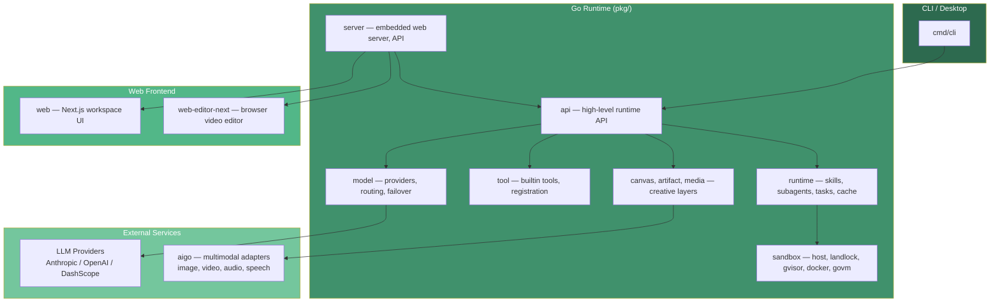

# Saker

[](https://github.com/cinience/saker/actions/workflows/ci.yml)
[](https://github.com/cinience/saker/actions/workflows/codeql.yml)
[](https://goreportcard.com/report/github.com/cinience/saker)
[](LICENSE)
[](https://codecov.io/gh/cinience/saker)

Saker is a source-available creative agent runtime. It combines a Go agent backend,
a web workspace, and a browser video editor so a single project can move from
prompting and planning to media generation, review, and automation.

[中文](README_zh.md)

## Architecture



## Feature Overview

### Agent Runtime

| Feature | Description |
| --- | --- |
| Core Loop | Iterative LLM-tool loop with configurable iterations, timeout, stop-reason taxonomy |
| Budget & Token Guard | Abort runs when cumulative cost (USD) or token count exceeds thresholds |
| Repeat Loop Detection | Abort on identical consecutive tool calls; optional self-correction hints |
| SSE Streaming | Anthropic-compatible SSE protocol with agent-specific event extensions |
| Session Management | Multi-session runtime (default 1000 sessions) with lifecycle tracking |
| Context Compaction | Prompt summarization and history pruning (compact & microcompact) |
| Profile Isolation | Named profiles for isolated settings, memory, and history |
| Cache & Checkpoint | File/memory-backed cache for deduplication; checkpoints for pipeline resumption |

### Model & Routing

| Feature | Description |
| --- | --- |
| Anthropic Provider | SDK with configurable API key, model, temperature, max tokens, retries |
| OpenAI Provider | Chat completions, streaming, Responses API, tool calls, ExtraBody |
| Provider Caching | TTL-based client caching with double-checked locking |
| Failover Model | Multi-model failover with retry, exponential backoff, buffering stream handler |
| Smart Routing | Prompt complexity classification for cost-aware model selection |
| Rate Limit Tracking | Capture rate limit headers per provider; HTTP transport wrapper |
| Prompt Caching | Enable prompt caching for system and recent messages |
| Error Classification | Classify errors (retryable, rate-limited, auth, context-length) for failover |

### Tool System — 37 Built-in Tools

| Category | Tools |
| --- | --- |
| File Ops | Read, Write, Edit, Glob, Grep, ImageRead |
| Shell | Bash, BashOutput, BashStatus |
| Web | WebFetch, WebSearch, Webhook (SSRF-safe) |
| Interaction | AskUserQuestion, Skill, SlashCommand |
| Memory | MemorySave, MemoryRead |
| Canvas | CanvasGetNode, CanvasListNodes, CanvasTableWrite |
| Task | TaskCreate, TaskGet, TaskList, TaskUpdate, KillTask, TodoWrite |
| Video & Media | AnalyzeVideo, VideoSampler, VideoSummarizer, FrameAnalyzer, MediaIndex, MediaSearch |
| Stream | StreamCapture, StreamMonitor |
| Browser & Dynamic | Browser, Aigo (YAML-driven) |

Plus: Tool Registry, Schema Validation, Permission Resolver, Output Persister, Streaming Execution

### Sandbox & Security

| Feature | Description |
| --- | --- |
| 5 Sandbox Backends | Host, Landlock (LSM), gVisor (runsc), Docker (network disabled), GoVM (lightweight VM) |
| SSRF Protection | Block localhost, private IPs, metadata IPs; fail-closed on DNS errors |
| Leak Detection | Regex-based secret scanning with severity levels, masking, sanitization |
| Permission Matrix | Per-tool rules (allow/deny/ask) from permissions.json |
| Path Validation | Symlink detection, max depth (128), traversal prevention |
| MIME Detection | Content-first (512-byte probe) with extension fallback |
| CORS & Rate Limiting | Configurable origins; token-bucket per IP (RPS + burst) |
| Security Headers | X-Content-Type-Options, X-Frame-Options, etc. |

### Server & API

| Feature | Description |
| --- | --- |
| Gin HTTP Engine | Route registration, middleware stacking, swagger annotations |
| WebSocket JSON-RPC | Bidirectional with ping/pong keepalive, serialized writes |
| Auth System | Local (bcrypt + HMAC), LDAP, OIDC with role mapping |
| File Upload | 50MB max, content-based MIME, UUID-prefixed, 24h expiry |
| REST APIs | Canvas, Apps, Skills, Memory, Personas, Projects, Threads, Turns, Users, Invites, Channels, Teams |
| Cron Scheduler | 3 schedule types (interval/cron/once), max 5 concurrent jobs |
| Active Turn Tracker | Concurrent turn tracking with max concurrency enforcement |
| Title Generation | Auto-generate thread titles from first prompt via model |

### Canvas & Media

| Feature | Description |
| --- | --- |
| Canvas Document | Nodes, Edges (flow/reference/context), Viewport as JSON |
| Canvas Executor | Topological DAG walker dispatching gen nodes through runtime |
| Canvas Writeback | Auto-write generated media back to canvas nodes |
| 40+ Node Types | Agent, AI, Audio, Composition, Export, ImageGen, LLM, Mask, Prompt, VideoGen, VoiceGen, etc. |
| Artifact Lineage | Provenance tracking with DOT format export |
| Media Indexer | Searchable index with keyframes and Chromem embeddings |
| Media Transcription | Whisper-based audio/video transcription |
| Video Analysis | Frame sampling, summarization, content description |
| Media Clip Trimmer | FFmpeg-based clip trimming with configurable times |

### Hooks & Events

| Feature | Description |
| --- | --- |
| PreToolUse | Intercept tool calls before execution; deny or modify |
| PostToolUse | Intercept tool results; modify output or trigger side effects |
| UserPromptSubmit | Intercept user prompts for preprocessing |
| 15 Event Types | Pre/PostToolUse, Compact, Session, Subagent, Notification, TokenUsage, etc. |
| Event Bus | Pub/sub with per-subscriber queues, deduplication, fan-out buffering |
| Shell Hook Scripts | Execute shell scripts as hook callbacks with timeout |
| Async Timeout | Configurable timeout for async hook execution |

### Skills & MCP

| Feature | Description |
| --- | --- |
| Skills Registry | Central registry with type-safe dispatch and fuzzy matching |
| SKILL.md Loader | Parse frontmatter from project directories |
| Skill Plaza | Marketplace for discovering and installing community skills |
| Skill Learner | Auto-generate skill definitions from project context |
| Skill Analytics | Track activation frequency, success rate, outcomes |
| SkillHub Client | Registry API (search, install, publish, versioning) with OAuth |
| MCP Spec Client | Parse server spec strings; create sessions with handshake |
| MCP Transports | stdio, SSE, and streamable HTTP transport builders |
| MCP Tool Discovery | List and register remote tools; namespace collision handling |
| MCP Tool Refresh | Handle tools/list_changed notifications via event bus |

### CLI & Modes

| Feature | Description |
| --- | --- |
| TUI Mode | Bubbletea terminal UI with waterfall display (default) |
| Print/Stream | Non-interactive output via --print/--stream flags |
| REPL Mode | Interactive readline shell with command handlers |
| Server Mode | Embedded web server with configurable address and data dir |
| ACP Mode | IDE/tool integration over stdio |
| Gateway Mode | IM bridge (Telegram, Feishu, Discord, Slack, DingTalk) |
| Pipeline Mode | Load pipeline JSON; --timeline/--lineage output |
| Video Stream | File/directory video processing with configurable sampling |
| Eval Mode | Run evaluation suites from CLI |
| Profile Subcommand | Isolated profile creation and switching |
| Sandbox/MCP/Auth Flags | Backend, mount, image; repeatable MCP; one-shot auth setup |

### Frontend

| Feature | Description |
| --- | --- |
| Chat App | Streaming messages, markdown, artifact extraction, multimodal content |
| Composer | Prompt input with file attachment and mode selection |
| Canvas View | DAG viewer with node rendering, edge visualization, viewport |
| Approval & Question Cards | Human-in-the-loop tool approval and clarification |
| Settings Panel | Aigo, Auth, Failover, Memory, Persona, Sandbox, Skills sections |
| Project Management | Create, delete, settings, invite, member roles, ownership transfer |
| Skill Plaza | Marketplace browsing and skill import |
| Cron UI | CronJob form, list, run log, active turns |
| App Runner | Execute canvas apps with form input |
| i18n | Multi-language UI support |

### Browser Video Editor

| Feature | Description |
| --- | --- |
| Timeline | Multi-track layout with audio, video, text, effect tracks |
| Animation | Keyframe-based with bezier curves and interpolation |
| Effects System | Registry, components, param channel animation |
| Subtitles | ASS/SRT parsing, building, and insertion |
| Transcription | LLM-based audio transcription with diagnostics |
| Preview & Guides | Rendering overlays, zoom, hit-testing, grid and snap-to-grid |
| WASM Processing | Browser-side media rendering via WebAssembly |
| Export | MIME-type mapping, format configuration |
| Undo/Redo | Command pattern with clipboard operations |
| Audio Display | Waveform visualization and separation |
| Bridge Integration | AI-assisted editing via Saker runtime connection |

## Requirements

- Go 1.26 or newer
- Node.js 22 or newer
- npm
- Optional: Docker for e2e and sandbox-related tests

## Quick Start

Install frontend dependencies once:

```bash
cd web && npm ci
cd ../web-editor-next && npm ci
cd ..
```

Build and run the full embedded server:

```bash
make run
```

The command builds `web`, builds `web-editor-next`, embeds both static bundles
into the Go binary, and starts the server on `http://localhost:10112`.

Build only the CLI/backend:

```bash
make saker
./bin/saker --version
```

Run a one-shot prompt:

```bash
export ANTHROPIC_API_KEY=sk-ant-...
./bin/saker --print "Draft a 30-second product video concept"
```

Run local frontend development servers:

```bash
make web-dev          # http://localhost:10111
make web-editor-dev   # editor app development server
```

## Configuration

Saker keeps project-local runtime state in `.saker/`, which is ignored by git.

Common environment variables:

```bash
ANTHROPIC_API_KEY=
OPENAI_API_KEY=
DASHSCOPE_API_KEY=
SAKER_MODEL=claude-sonnet-4-5-20250929
```

Copy `.env.example` for local development if you prefer dotenv-style setup.

Server auth can be configured with:

```bash
./bin/saker --auth-user admin --auth-pass '<password>'
./bin/saker --server
```

## Repository Layout

```text
saker/
├── cmd/                 # CLI, embedded web server, desktop entry
├── pkg/                 # Go runtime, tools, server, model providers, media, sandbox
├── web/                 # Main Next.js web workspace
├── web-editor-next/     # Browser video editor mounted at /editor/
├── examples/            # SDK, CLI, HTTP, hooks, multimodel, pipeline examples
├── test/                # Integration and pipeline tests
├── e2e/                 # Docker-based end-to-end suites
├── eval/                # Evaluation harnesses
├── skills/              # Built-in skills
├── docs/                # Stable open-source project documentation
```

## Development

Useful commands:

```bash
make test-short
make test-unit
make test-pipeline
make server-dev
make server
```

Frontend checks:

```bash
cd web && npm run test && npm run build
cd ../web-editor-next && npm run build
```

The full production build is:

```bash
make build
```

## Documentation

- [Project overview](docs/overview.md)
- [Development guide](docs/development.md)
- [Configuration](docs/configuration.md)
- [Deployment guide](docs/deployment.md)
- [Security policy](../SECURITY.md)
- [Security model](docs/security.md)
- [API reference](docs/api-reference.md)
- [Third-party notices](docs/third-party-notices.md)
- [Roadmap](ROADMAP.md)
- [Changelog](CHANGELOG.md)

## License Notes

Saker is licensed under the **Saker Source License Version 1.0 (SKL-1.0)** — a source-available license based on Apache 2.0 with additional terms.

**Key points:**

- **Free for small teams and individuals** — organizations with annual gross revenue ≤ 1,000,000 CNY (~$140,000 USD) AND ≤ 100 registered users may use this software in production without restriction.
- **Commercial license required** — if your annual gross revenue exceeds 1,000,000 CNY (~$140,000 USD) OR your registered user count exceeds 100, you must obtain a commercial license before production use. Contact: cinience@hotmail.com
- **Non-production use is always free** — evaluation, testing, development, personal learning, and research are permitted regardless of revenue.
- **Attribution required for derivative works** — if you build upon this project, you must display "Powered by Saker.cc" in your user interface and documentation.

Upstream notices are maintained in `NOTICE`, and dependency/asset license inventory is maintained in [docs/third-party-notices.md](docs/third-party-notices.md).

The browser editor under `web-editor-next/` contains MIT-licensed code derived from OpenCut. Its asset notes live in `web-editor-next/ASSET_LICENSES.md`.

The `godeps` packages (aigo, goim, govm) are remote Go modules resolved
through `go.mod`, not local in-tree directories.

## Contributing

Issues and pull requests are welcome. Before submitting changes, run the checks
for the area you touched and include any relevant setup notes in the pull
request.
