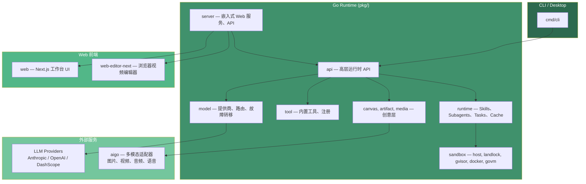

# Saker

[](https://github.com/cinience/saker/actions/workflows/ci.yml)
[](https://github.com/cinience/saker/actions/workflows/codeql.yml)
[](https://goreportcard.com/report/github.com/cinience/saker)
[](LICENSE)
[](https://codecov.io/gh/cinience/saker)

Saker 是一个 source-available 的创意 Agent 运行时。它把 Go 后端 Agent、Web 工作台和浏览器视频编辑器组合在一起，让一个项目可以从提示词、策划、素材生成一路走到审阅、编辑和自动化执行。

[English](README.md)

## 架构



## 包含什么

| 模块 | 说明 |
| --- | --- |
| Agent 运行时 | CLI、流式执行、Skills、Subagents、记忆、Hooks、模型路由、MCP 和沙箱后端。 |
| 创意工作台 | 基于 Next.js 的 Web UI，用于对话、画布式创作、素材和项目状态管理。 |
| 视频编辑器 | 静态导出的浏览器编辑器，在嵌入式服务中挂载到 `/editor/`。 |
| 多模态工具 | 通过 `aigo` 适配图片、视频、音频、语音、转写和媒体理解能力。 |
| 开发者接口 | Go SDK、HTTP/Server 模式、示例、集成测试、评测、Docker 配置。 |

## 环境要求

- Go 1.26 或更新版本
- Node.js 22 或更新版本
- npm
- 可选：Docker，用于 e2e 和部分沙箱测试

## 快速开始

首次安装前端依赖：

```bash
cd web && npm ci
cd ../web-editor-next && npm ci
cd ..
```

构建并启动完整嵌入式服务：

```bash
make run
```

该命令会构建 `web`、构建 `web-editor-next`、把两个静态产物嵌入 Go 二进制，并在 `http://localhost:10112` 启动服务。

只构建 CLI/后端：

```bash
make saker
./bin/saker --version
```

执行一次性提示词：

```bash
export ANTHROPIC_API_KEY=sk-ant-...
./bin/saker --print "Draft a 30-second product video concept"
```

启动前端开发服务：

```bash
make web-dev          # http://localhost:10111
make web-editor-dev   # 编辑器开发服务
```

## 配置

Saker 的项目本地状态保存在 `.saker/`，该目录已被 git 忽略。

常用环境变量：

```bash
ANTHROPIC_API_KEY=
OPENAI_API_KEY=
DASHSCOPE_API_KEY=
SAKER_MODEL=claude-sonnet-4-5-20250929
```

本地开发可以复制 `.env.example`。

服务端 Web 登录信息可以这样设置：

```bash
./bin/saker --auth-user admin --auth-pass '<password>'
./bin/saker --server
```

## 仓库结构

```text
saker/
├── cmd/                 # CLI、嵌入式 Web 服务、桌面入口
├── pkg/                 # Go 运行时、工具、服务、模型提供商、媒体、沙箱
├── web/                 # 主 Next.js Web 工作台
├── web-editor-next/     # 挂载到 /editor/ 的浏览器视频编辑器
├── examples/            # SDK、CLI、HTTP、Hooks、多模型、Pipeline 示例
├── test/                # 集成测试和 Pipeline 测试
├── e2e/                 # Docker e2e 测试
├── eval/                # 评测框架
├── skills/              # 内置 Skills
├── docs/                # 稳定的开源项目文档
```

## 开发

常用命令：

```bash
make test-short
make test-unit
make test-pipeline
make server-dev
make server
```

前端检查：

```bash
cd web && npm run test && npm run build
cd ../web-editor-next && npm run build
```

完整生产构建：

```bash
make build
```

## 文档

- [项目概览](docs/overview.md)
- [开发指南](docs/development.md)
- [配置说明](docs/configuration.md)
- [部署指南](docs/deployment.md)
- [安全策略](../SECURITY.md)
- [安全模型](docs/security.md)
- [API 参考](docs/api-reference.md)
- [第三方依赖声明](docs/third-party-notices.md)
- [路线图](ROADMAP.md)
- [变更日志](CHANGELOG.md)

## 许可证说明

Saker 使用 **Saker Source License Version 1.0 (SKL-1.0)** — 基于 Apache 2.0 并附加条款的 source-available 许可证。

**要点：**

- **小团队和个人免费** — 年营收 ≤ 100万人民币（约 $140,000 USD）且注册用户数 ≤ 100 的组织可无限制地在生产环境使用。
- **商业授权** — 年营收超过 100万人民币（约 $140,000 USD）或注册用户数超过 100 的组织须先获取商业许可证才能在生产环境使用。联系：cinience@hotmail.com
- **非生产用途始终免费** — 评估、测试、开发、个人学习、研究不受营收限制。
- **衍生作品需标注出处** — 基于本项目构建的衍生作品须在用户界面和文档中展示 "Powered by Saker.cc"。

上游代码说明保留在 `NOTICE`，依赖和素材许可证清单保留在 [docs/third-party-notices.md](docs/third-party-notices.md)。

`web-editor-next/` 下的浏览器编辑器包含 MIT 许可的 OpenCut 衍生代码，素材说明见 `web-editor-next/ASSET_LICENSES.md`。

`godeps` 包（aigo、goim、govm）是通过 `go.mod` 解析的远程 Go 模块，而非本地目录。

## 贡献

欢迎提交 Issue 和 Pull Request。提交前请运行本次改动相关的测试或构建命令，并在 PR 中说明必要的环境配置。
