<div align="center">

# Saker

<p>
  
  
  
  <a href="https://github.com/cinience/saker/actions/workflows/ci.yml"></a>
  <a href="https://github.com/cinience/saker/actions/workflows/codeql.yml"></a>
  <a href="https://goreportcard.com/report/github.com/cinience/saker"></a>
  <a href="https://codecov.io/gh/cinience/saker"></a>
</p>

**面向创作场景的源码可见 Agent 运行时。**
一行 prompt 起步，生成、审阅、自动化全流程，落在同一个二进制里。

<a href="#快速开始">快速开始</a> ·
<a href="#功能特性">功能</a> ·
<a href="#架构">架构</a> ·
<a href="#文档">文档</a> ·
<a href="README.md">English</a>

<br>


</div>

---

## Saker 是什么

Saker 把创作团队通常分散使用的三层栈 &mdash; agent 运行时、Web 工作台、浏览器视频剪辑器 &mdash; 合并到同一个 Go 二进制里。它覆盖完整的创意循环：写 prompt、规划任务、生成媒体素材、人工审阅，再通过自动化或 IM 渠道发出。无论是 CLI、TUI、HTTP server、IM bot 还是 Wails 桌面应用，运行方式和数据都保持一致，全部 local-first、内嵌式。

## 为什么选择 Saker

| 痛点 | 业界常见做法 | Saker 的取舍 |
|---|---|---|
| 创作链路散落在多个工具里 | 独立维护 prompting、生成、剪辑三套后端 | 一份二进制内嵌工作台、剪辑器、运行时、网关 |
| 沙箱要么不安全要么用不上 | 只支持 Docker 或只允许跑在宿主机 | 五种后端 &mdash; host、Landlock、gVisor、Docker、govm &mdash; 按宿主机能力自动降级 |
| 模型与工具被供应商锁死 | 单一 provider、单一工具表 | 多 provider 失败转移与智能路由；33 个内置工具，加 MCP server 与远程工具 |
| 服务器端多租户难以部署 | 只有本地 CLI | 内置 OAuth/LDAP/Bearer 认证、CSRF、CORS、SSRF 防护、路径穿越加固、按项目隔离 |
| 可观测性总是事后补 | 出了问题再接 OTel | Prometheus 指标、结构化 slog、OTel span、贯穿链路的 request ID 一开始就有 |

## 快速开始

### 前置条件

- Go 1.26 或更高版本
- Node.js 22 或更高版本
- pnpm（仓库是覆盖 `web/`、`web-editor-next/`、`packages/` 的 pnpm workspace）
- Docker（可选 &mdash; Docker / govm 沙箱后端与 e2e 套件需要）

### 构建并运行

```bash
git clone https://github.com/cinience/saker.git
cd saker

pnpm install                      # 安装前端依赖
make run                          # 构建前端、嵌入二进制、启动 :10112 server
```

打开 `http://localhost:10112` 访问工作台，`http://localhost:10112/editor/` 进入视频剪辑器。

### CLI 用法

```bash
make saker                        # 构建 CLI

export ANTHROPIC_API_KEY=sk-ant-...
./bin/saker --print "起一个 30 秒的产品视频脚本"
./bin/saker                       # 进入交互式 TUI
```

### 前端开发模式

```bash
make web-dev                      # 工作台开发服务器 http://localhost:10111
make web-editor-dev               # 剪辑器开发服务器
```

## 功能特性

### Agent 运行时

| 能力 | 说明 |
|---|---|
| 主循环 | 迭代上限、超时、分类的 `StopReason`（`completed` / `max_iterations` / `max_budget` / `max_tokens` / `repeat_loop` / abort 系列 / `model_error`）|
| 预算守护 | 累计成本或 token 触顶即中断 |
| 死循环检测 | 重复同一工具调用即停；可选自我纠正 prompt |
| SSE 流 | 兼容 Anthropic SSE 协议，附 agent 专属事件扩展 |
| 会话历史 | 内存环形缓冲，默认 1000 轮，可配 |
| 上下文压缩 | `compact` 与 `microcompact` 两种策略，prompt 摘要 + 历史裁剪 |
| Profiles | 命名 profile 隔离设置、记忆与历史 |
| Subagents | 子运行时分叉，可选 git worktree，转录原路返回 |
| Checkpoints | 通过内存或文件后端保存可恢复的会话/run 状态 |

### 模型

| 能力 | 说明 |
|---|---|
| Provider | Anthropic、OpenAI（Chat + Responses API）、MCP 路由的第三方 |
| 失败转移 | 多模型 fallback，指数退避，stream buffering |
| 智能路由 | 基于 prompt 复杂度 / 成本权衡的模型选择 |
| 限流跟踪 | 通过 HTTP transport wrapper 抓取每家 provider 的 header |
| Prompt 缓存 | system 与最近若干轮消息的缓存 |

### 工具（33 个内置 + memory + MCP）

<details>
<summary>展开查看注册的内置工具</summary>

| 类别 | 工具 |
|---|---|
| 文件 | `file_read`、`file_write`、`file_edit`、`glob`、`grep`、`image_read` |
| Shell | `bash`、`bash_output`、`bash_status`、`kill_task` |
| Web | `web_fetch`、`web_search`、`webhook`（带 SSRF 防护）、`browser`（chromedp）|
| 交互 | `ask_user_question`、`skill`、`slash_command` |
| 记忆 | `memory_save`、`memory_read` |
| Canvas | `canvas_get_node`、`canvas_list_nodes`、`canvas_table_write` |
| 任务 | `task_create`、`task_get`、`task_list`、`task_update`、`task`（spawn subagent）|
| 视频 / 媒体 | `analyze_video`、`video_sampler`、`video_summarizer`、`frame_analyzer`、`media_index`、`media_search` |
| Stream | `stream_capture`、`stream_monitor` |

权威清单：`pkg/api/runtime_tools_register.go`。MCP 与远程工具会在内置工具之上注册。

</details>

### 沙箱与安全

| 能力 | 说明 |
|---|---|
| 五种后端 | `host`、`landlock`（LSM，helper 进程）、`gvisor`（runsc，helper 进程）、`docker`（默认禁网）、`govm`（基于 `godeps/govm` 的微 VM）|
| 文件系统策略 | allow / deny 列表 + 路径映射（`pkg/sandbox/pathmap`）+ `O_NOFOLLOW` 安全打开 |
| SSRF 防护 | 拦截 loopback、私网段、链路本地、metadata 端点；DNS rebinding 安全关闭 |
| 泄漏检测 | 正则秘密扫描，带严重级、掩码与清理 |
| 权限矩阵 | 来自 `permissions.json` 的逐工具 `allow / deny / ask` 规则；运行时 resolver；批准提示 |
| 认证 | 本地凭证、OIDC、LDAP、Bearer token；按项目 / 按用户的 scope 中间件 |

### Canvas 与媒体

- 类型化的 DAG 文档（节点 + flow / reference / context 边）
- 40+ 节点类型（Agent、AI、Audio、Composition、Export、ImageGen、LLM、Mask、Prompt、VideoGen、VoiceGen 等）
- 拓扑排序执行器，把生成节点回派到 agent 运行时
- 含关键帧的媒体索引 + 基于 `chromem-go` 的向量嵌入；全文与语义搜索
- 音频转写、视频摘要、逐帧分析三条管线

### 浏览器视频剪辑器

| 能力 | 说明 |
|---|---|
| 时间轴 | 多轨道音频 / 视频 / 文字 / 特效 |
| 动画 | 支持 Bezier 插值的关键帧 |
| 特效 | 注册表、按特效拆分组件、参数 channel 动画 |
| 字幕 | ASS / SRT 解析 / 构建 / 插入 |
| 转写 | 由 LLM 驱动的音频转写，附诊断信息 |
| 预览 | 渲染遮罩、缩放、栅格、吸附 |
| WASM 渲染 | 通过 WebAssembly 在浏览器端做媒体渲染 |
| 历史 | 命令模式 undo / redo，含剪贴板支持 |

衍生自 [OpenCut](https://github.com/OpenCut-app/OpenCut)（MIT 协议）。素材署名见 `web-editor-next/ASSET_LICENSES.md`。

### IM 网关

Saker 可以桥接 10 个聊天平台，让用户在熟悉的 app 里直接和 agent 对话：

`telegram` · `feishu` · `discord` · `slack` · `dingtalk` · `wecom` · `qq` · `qqbot` · `line` · `weixin`

```bash
./bin/saker --gateway telegram --gateway-token "<bot-token>"
./bin/saker --gateway-config gateway.toml          # 多平台配置
```

也可以通过 TUI（`im_config` 工具）或工作台的设置面板维护通道。

## 架构

<div align="center">
  
</div>

每个包的具体角色请见 [docs/architecture.md](docs/architecture.md)。

### 单次请求的数据流

1. **Surface** &mdash; CLI/TUI/HTTP/IM/ACP 入口解析输入并选定 profile。
2. **Runtime** &mdash; `pkg/api.Runtime` 加载设置，构建沙箱，注册 builtin + MCP + 远程工具，挂上人格 / 记忆 / sessiondb / skills / subagents / cache。
3. **Loop** &mdash; `pkg/agent.Agent.Run` 迭代直到 `StopReason` 触发；预算、死循环检测、压缩在循环外把守。
4. **Model** &mdash; `pkg/model` provider 走 failover 与路由；调用经由 `pkg/metrics` 与（开启 `-tags otel` 时）`pkg/api/otel.go` 仪表化。
5. **Tool** &mdash; 解析权限、跑 PreToolUse hook，分发到 builtin / MCP / 远程工具。涉及文件的工具会跨越 `pkg/sandbox` 边界。
6. **Stream** &mdash; 结果以 `StreamEvent` 形式流回 SSE / WebSocket 客户端、TUI 瀑布或 IM 网关。

## 仓库结构

```
saker/
├── cmd/                  # CLI 调度器（cmd/saker）与 Wails 桌面壳（cmd/desktop）
├── pkg/                  # Go 运行时：api、agent、model、tool、runtime、server、sandbox、security、
│                         # canvas、pipeline、media、artifact、sessiondb、memory、persona、project、
│                         # storage、config、middleware、metrics、clikit、mcp、acp、im、skillhub …
├── web/                  # Next.js 16 工作台（saker-web）
├── web-editor-next/      # 衍生自 OpenCut 的浏览器视频剪辑器（saker-web-editor）
├── packages/             # 共享 TS workspace 包（editor-protocol）
├── examples/             # 20 个编号示例（01-basic … 20-realtime-video）
├── test/                 # 集成、pipeline、运行时、安全套件
├── e2e/                  # 基于 Docker 的端到端套件
├── eval/                 # Eval 框架（offline + LLM + Terminal-Bench）
├── docs/                 # 文档、ADR、图表（mermaid 源 + 渲染 SVG）
├── bench/                # 基准基线
└── scripts/              # 仓库维护脚本
```

## 文档

| 文档 | 说明 |
|---|---|
| [概览](docs/overview.md) | 高层总结 |
| [架构](docs/architecture.md) | 详细 mermaid 架构图与请求时序 |
| [开发指南](docs/development.md) | 本地开发流程、测试、约定 |
| [配置](docs/configuration.md) | 设置、profile、环境变量 |
| [部署](docs/deployment.md) | 生产部署说明 |
| [安全模型](docs/security.md) | 威胁模型与防御 |
| [可观测性](docs/observability.md) | 指标、日志、OTel |
| [测试](docs/testing.md) | 测试分类与执行框架 |
| [API 参考](docs/api-reference.md) | REST / WS / SSE 接口面 |
| [ADR](docs/adr/) | 架构决策记录 |
| [安全策略](SECURITY.md) | 漏洞上报 |
| [第三方声明](docs/third-party-notices.md) | 依赖许可证 |
| [Roadmap](ROADMAP.md) | 计划中的工作 |
| [Changelog](CHANGELOG.md) | 版本历史 |

## 开发

```bash
make test-short        # 快速子集，开发循环用
make test-unit         # 单元测试 + race detector
make test-pipeline     # pipeline 集成测试
make lint              # golangci-lint
make bench             # 基准 → bench/baseline.txt

make server-dev        # 仅 Go 的开发 server（不嵌前端）
make server            # 完整构建 + 嵌入 + 启动
make build             # 复合的生产构建（web + editor + 二进制）
make diagrams          # 从 docs/diagrams/*.mmd 重渲染 docs/images/*.svg
```

前端检查：

```bash
pnpm --filter saker-web        run test
pnpm --filter saker-web        run build
pnpm --filter saker-web-editor run build
```

## 配置

项目本地的运行时状态放在 `.saker/`（已被 git 忽略）。

```bash
ANTHROPIC_API_KEY=    # Anthropic
OPENAI_API_KEY=       # OpenAI
DASHSCOPE_API_KEY=    # DashScope（走 OpenAI 兼容协议）
SAKER_MODEL=          # 默认模型，例如 claude-sonnet-4-5-20250929
```

服务器端认证：

```bash
./bin/saker --auth-user admin --auth-pass '<password>'
./bin/saker --server
```

## 贡献

欢迎 issue 和 PR。提交前请运行相关测试与构建，并在 PR 描述里写清楚搭建步骤。详见 [CONTRIBUTING.md](CONTRIBUTING.md)。

## 许可证

Saker 使用 **Saker Source License Version 1.0（SKL-1.0）** &mdash; 源码可见，基于 Apache 2.0 增加附加条款。

| 场景 | 条款 |
|---|---|
| 小团队 / 个人 | 年收入 ≤ ¥1,000,000 **且** 注册用户 ≤ 100 时可免费用于生产 |
| 需要商业许可 | 年收入 > ¥1,000,000 **或** 注册用户 > 100 |
| 非生产用途 | 始终免费 &mdash; 评估、测试、开发、学习、研究 |
| 衍生作品 | 必须在产品 UI 与文档中标注 "Powered by Saker.cc" |

商业授权请联系：[cinience@hotmail.com](mailto:cinience@hotmail.com)。

- 上游声明位于 [NOTICE](NOTICE)；依赖许可证清单见 [docs/third-party-notices.md](docs/third-party-notices.md)。
- `web-editor-next/` 下的代码衍生自 OpenCut（MIT）；素材署名见 `web-editor-next/ASSET_LICENSES.md`。
- `godeps/*` 包（`aigo`、`goim`、`govm`）是通过 `go.mod` 解析的远程 Go module，并不是本地目录。

---

<div align="center">
  由 <a href="https://saker.cc">Saker.cc</a> 出品
</div>
