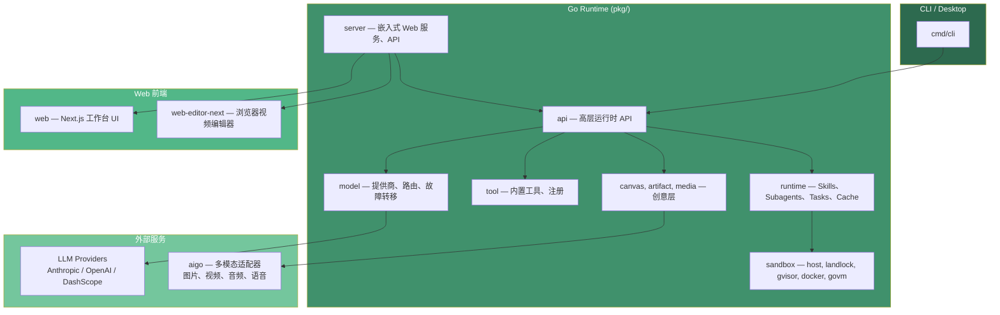

# Saker

[](https://github.com/cinience/saker/actions/workflows/ci.yml)
[](https://github.com/cinience/saker/actions/workflows/codeql.yml)
[](https://goreportcard.com/report/github.com/cinience/saker)
[](LICENSE)
[](https://codecov.io/gh/cinience/saker)

Saker 是一个 source-available 的创意 Agent 运行时。它把 Go 后端 Agent、Web 工作台和浏览器视频编辑器组合在一起，让一个项目可以从提示词、策划、素材生成一路走到审阅、编辑和自动化执行。

[English](README.md)

## 架构



## 功能概览

### Agent 运行时

| 功能 | 说明 |
| --- | --- |
| 核心循环 | 可配置迭代次数、超时、停止原因分类的 LLM-工具交互循环 |
| 预算与令牌守卫 | 累计成本（USD）或令牌数超限时中止运行 |
| 重复循环检测 | 连续相同工具调用超阈值时中止；可选自纠正提示 |
| SSE 流式传输 | Anthropic 兼容 SSE 协议，附带 Agent 专用事件扩展 |
| 会话管理 | 多会话运行时（默认 1000 会话），含生命周期追踪 |
| 上下文压缩 | 提示摘要与历史裁剪（compact 与 microcompact） |
| Profile 隔离 | 命名 Profile 实现设置、记忆、历史的隔离 |
| 缓存与断点 | 文件/内存缓存去重；断点支持 Pipeline 恢复 |

### 模型与路由

| 功能 | 说明 |
| --- | --- |
| Anthropic 提供商 | SDK 集成，可配置 API Key、模型、温度、最大令牌、重试 |
| OpenAI 提供商 | Chat Completions、流式、Responses API、工具调用、ExtraBody |
| 提供商缓存 | TTL 客户端缓存，双重检查锁 |
| 故障转移 | 多模型故障转移，含重试、指数退避、缓冲流处理器 |
| 智能路由 | 提示复杂度分类，实现成本感知的模型选择 |
| 速率限制追踪 | 按提供商捕获速率限制头；HTTP Transport 包装器 |
| 提示缓存 | 启用系统消息和近期消息的提示缓存 |
| 错误分类 | 可重试、限速、认证、上下文长度等错误分类用于故障转移 |

### 工具系统 — 37 个内置工具

| 类别 | 工具 |
| --- | --- |
| 文件操作 | Read, Write, Edit, Glob, Grep, ImageRead |
| Shell | Bash, BashOutput, BashStatus |
| Web | WebFetch, WebSearch, Webhook（SSRF 安全） |
| 交互 | AskUserQuestion, Skill, SlashCommand |
| 记忆 | MemorySave, MemoryRead |
| 画布 | CanvasGetNode, CanvasListNodes, CanvasTableWrite |
| 任务 | TaskCreate, TaskGet, TaskList, TaskUpdate, KillTask, TodoWrite |
| 视频与媒体 | AnalyzeVideo, VideoSampler, VideoSummarizer, FrameAnalyzer, MediaIndex, MediaSearch |
| 流 | StreamCapture, StreamMonitor |
| 浏览器与动态 | Browser, Aigo（YAML 驱动） |

另有：工具注册表、Schema 校验、权限解析器、输出持久化、流式执行

### 沙箱与安全

| 功能 | 说明 |
| --- | --- |
| 5 种沙箱后端 | Host、Landlock（LSM）、gVisor（runsc）、Docker（网络默认关闭）、GoVM（轻量 VM） |
| SSRF 防护 | 拦截 localhost、私有 IP、元数据 IP；DNS 错误时安全关闭 |
| 泄露检测 | 正则密钥扫描，含严重级别、遮蔽、净化 |
| 权限矩阵 | 基于 permissions.json 的逐工具规则（允许/拒绝/询问） |
| 路径校验 | 符号链接检测、最大深度 128、路径遍历防护 |
| MIME 检测 | 内容优先（512 字节探测），扩展名兜底 |
| CORS 与限速 | 可配置来源；IP 令牌桶限速（RPS + burst） |
| 安全头 | X-Content-Type-Options、X-Frame-Options 等 |

### 服务与 API

| 功能 | 说明 |
| --- | --- |
| Gin HTTP 引擎 | 路由注册、中间件栈、Swagger 注解 |
| WebSocket JSON-RPC | 双向通信，含 ping/pong 保活、序列化写入 |
| 认证系统 | 本地（bcrypt + HMAC）、LDAP、OIDC 含角色映射 |
| 文件上传 | 50MB 上限、内容 MIME 检测、UUID 缀、24h 过期 |
| REST API | Canvas、Apps、Skills、Memory、Personas、Projects、Threads、Turns、Users、Invites、Channels、Teams |
| Cron 调度 | 3 种调度类型（间隔/cron/一次），最大 5 并发 |
| 活跃 Turn 追踪 | 并发 Turn 追踪与最大并发数控制 |
| 标题生成 | 模型推断自动生成 Thread 标题 |

### 画布与媒体

| 功能 | 说明 |
| --- | --- |
| 画布文档 | Nodes、Edges（流/引用/上下文）、Viewport JSON |
| 画布执行器 | 拓扑 DAG 遍历，将生成节点分发至运行时 |
| 画布回写 | 自动将生成的媒体写回画布节点 |
| 40+ 节点类型 | Agent, AI, Audio, Composition, Export, ImageGen, LLM, Mask, Prompt, VideoGen, VoiceGen 等 |
| Artifact 血缘 | 来源追踪，DOT 格式可视化导出 |
| 媒体索引 | 可搜索索引，含关键帧与 Chromem 向量嵌入 |
| 媒体转写 | Whisper 音频/视频转写 |
| 视频分析 | 帧采样、摘要、内容描述 |
| 媒体裁剪 | FFmpeg 裁剪，可配置起止时间 |

### Hooks 与事件

| 功能 | 说明 |
| --- | --- |
| PreToolUse | 工具执行前拦截；可拒绝或修改 |
| PostToolUse | 工具结果后拦截；可修改输出或触发副作用 |
| UserPromptSubmit | 用户提示提交前拦截与预处理 |
| 15 种事件类型 | Pre/PostToolUse, Compact, Session, Subagent, Notification, TokenUsage 等 |
| 事件总线 | 发布/订阅，含逐订阅者队列、去重、扇出缓冲 |
| Shell Hook 脚本 | 以 Shell 脚本执行 Hook 回调，含超时 |
| 异步超时 | 可配置异步 Hook 执行超时 |

### Skills 与 MCP

| 功能 | 说明 |
| --- | --- |
| Skills 注册表 | 中心注册表，含类型安全分发与模糊匹配 |
| SKILL.md 加载器 | 从项目目录解析 frontmatter |
| Skill Plaza | 发现和安装社区技能的市场 |
| Skill 学习器 | 从项目上下文自动生成技能定义 |
| Skill 分析 | 追踪激活频率、成功率、结果 |
| SkillHub 客户端 | 注册表 API（搜索、安装、发布、版本）含 OAuth |
| MCP 规格客户端 | 解析服务规格字符串；会话握手与能力协商 |
| MCP 传输层 | stdio、SSE、streamable HTTP 传输构建器 |
| MCP 工具发现 | 列出并注册远程工具；命名空间冲突处理 |
| MCP 工具刷新 | 通过事件总线处理 tools/list_changed 通知 |

### CLI 与模式

| 功能 | 说明 |
| --- | --- |
| TUI 模式 | Bubbletea 终端 UI，含瀑布流显示（默认） |
| Print/Stream | 非交互输出（--print/--stream） |
| REPL 模式 | readline 交互 Shell 含命令处理 |
| 服务模式 | 嵌入式 Web 服务，可配置地址与数据目录 |
| ACP 模式 | 基于 stdio 的 IDE/工具集成 |
| Gateway 模式 | IM 桥接（Telegram、飞书、Discord、Slack、钉钉） |
| Pipeline 模式 | 加载 Pipeline JSON；--timeline/--lineage 输出 |
| Video Stream | 文件/目录视频处理，可配置采样 |
| Eval 模式 | 从 CLI 运行评测套件 |
| Profile 子命令 | 隔离 Profile 创建与切换 |
| 沙箱/MCP/认证标志 | 后端、挂载、镜像；可重复 MCP；一次性认证设置 |

### 前端

| 功能 | 说明 |
| --- | --- |
| Chat 应用 | 流式消息、Markdown、Artifact 提取、多模态内容 |
| 输入器 | 提示输入，含文件附件与模式选择 |
| 画布视图 | DAG 视图，含节点渲染、边可视化、Viewport |
| 审批与提问卡片 | 人工介入的工具审批与澄清问答 |
| 设置面板 | Aigo、Auth、Failover、Memory、Persona、Sandbox、Skills 等分区 |
| 项目管理 | 创建、删除、设置、邀请、成员角色、所有权转移 |
| Skill Plaza | 市场浏览与技能导入 |
| Cron UI | CronJob 表单、列表、运行日志、活跃 Turn |
| App Runner | 表单输入执行画布应用 |
| i18n | 多语言界面支持 |

### 浏览器视频编辑器

| 功能 | 说明 |
| --- | --- |
| 时间线 | 多轨道布局，含音频、视频、文字、特效轨道 |
| 动画 | 关键帧动画，含贝塞尔曲线与插值 |
| 特效系统 | 注册表、组件、参数通道动画 |
| 字幕 | ASS/SRT 解析、构建与插入 |
| 转写 | LLM 音频转写含诊断 |
| 预览与参考线 | 渲染叠加、缩放、网格与对齐吸附 |
| WASM 处理 | 基于 WebAssembly 的浏览器端媒体渲染 |
| 导出 | MIME 类型映射与格式配置 |
| 撤销/重做 | 命令模式，含剪贴板操作 |
| 音频显示 | 波形可视化与分离 |
| Bridge 集成 | 通过 Saker 运行时连接实现 AI 辅助编辑 |

## 环境要求

- Go 1.26 或更新版本
- Node.js 22 或更新版本
- npm
- 可选：Docker，用于 e2e 和部分沙箱测试

## 快速开始

首次安装前端依赖：

```bash
cd web && npm ci
cd ../web-editor-next && npm ci
cd ..
```

构建并启动完整嵌入式服务：

```bash
make run
```

该命令会构建 `web`、构建 `web-editor-next`、把两个静态产物嵌入 Go 二进制，并在 `http://localhost:10112` 启动服务。

只构建 CLI/后端：

```bash
make saker
./bin/saker --version
```

执行一次性提示词：

```bash
export ANTHROPIC_API_KEY=sk-ant-...
./bin/saker --print "Draft a 30-second product video concept"
```

启动前端开发服务：

```bash
make web-dev          # http://localhost:10111
make web-editor-dev   # 编辑器开发服务
```

## 配置

Saker 的项目本地状态保存在 `.saker/`，该目录已被 git 忽略。

常用环境变量：

```bash
ANTHROPIC_API_KEY=
OPENAI_API_KEY=
DASHSCOPE_API_KEY=
SAKER_MODEL=claude-sonnet-4-5-20250929
```

本地开发可以复制 `.env.example`。

服务端 Web 登录信息可以这样设置：

```bash
./bin/saker --auth-user admin --auth-pass '<password>'
./bin/saker --server
```

## 仓库结构

```text
saker/
├── cmd/                 # CLI、嵌入式 Web 服务、桌面入口
├── pkg/                 # Go 运行时、工具、服务、模型提供商、媒体、沙箱
├── web/                 # 主 Next.js Web 工作台
├── web-editor-next/     # 挂载到 /editor/ 的浏览器视频编辑器
├── examples/            # SDK、CLI、HTTP、Hooks、多模型、Pipeline 示例
├── test/                # 集成测试和 Pipeline 测试
├── e2e/                 # Docker e2e 测试
├── eval/                # 评测框架
├── skills/              # 内置 Skills
├── docs/                # 稳定的开源项目文档
```

## 开发

常用命令：

```bash
make test-short
make test-unit
make test-pipeline
make server-dev
make server
```

前端检查：

```bash
cd web && npm run test && npm run build
cd ../web-editor-next && npm run build
```

完整生产构建：

```bash
make build
```

## 文档

- [项目概览](docs/overview.md)
- [开发指南](docs/development.md)
- [配置说明](docs/configuration.md)
- [部署指南](docs/deployment.md)
- [安全策略](../SECURITY.md)
- [安全模型](docs/security.md)
- [API 参考](docs/api-reference.md)
- [第三方依赖声明](docs/third-party-notices.md)
- [路线图](ROADMAP.md)
- [变更日志](CHANGELOG.md)

## 许可证说明

Saker 使用 **Saker Source License Version 1.0 (SKL-1.0)** — 基于 Apache 2.0 并附加条款的 source-available 许可证。

**要点：**

- **小团队和个人免费** — 年营收 ≤ 100万人民币（约 $140,000 USD）且注册用户数 ≤ 100 的组织可无限制地在生产环境使用。
- **商业授权** — 年营收超过 100万人民币（约 $140,000 USD）或注册用户数超过 100 的组织须先获取商业许可证才能在生产环境使用。联系：cinience@hotmail.com
- **非生产用途始终免费** — 评估、测试、开发、个人学习、研究不受营收限制。
- **衍生作品需标注出处** — 基于本项目构建的衍生作品须在用户界面和文档中展示 "Powered by Saker.cc"。

上游代码说明保留在 `NOTICE`，依赖和素材许可证清单保留在 [docs/third-party-notices.md](docs/third-party-notices.md)。

`web-editor-next/` 下的浏览器编辑器包含 MIT 许可的 OpenCut 衍生代码，素材说明见 `web-editor-next/ASSET_LICENSES.md`。

`godeps` 包（aigo、goim、govm）是通过 `go.mod` 解析的远程 Go 模块，而非本地目录。

## 贡献

欢迎提交 Issue 和 Pull Request。提交前请运行本次改动相关的测试或构建命令，并在 PR 中说明必要的环境配置。
