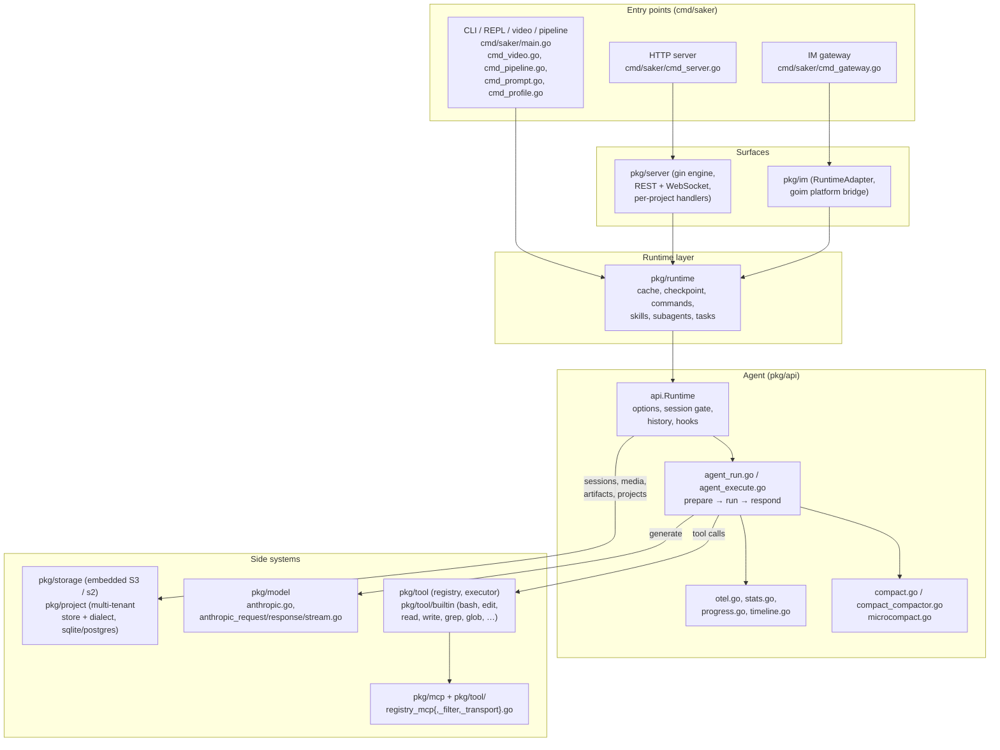
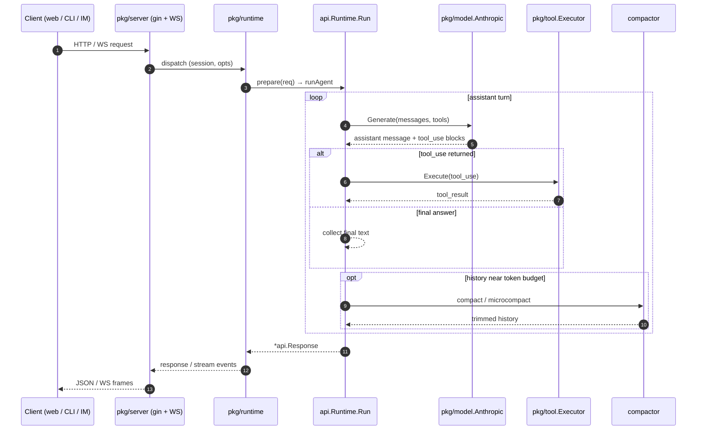

# Architecture

This document is a high-level map of how requests flow through Saker. Three
entry points (CLI, HTTP server, IM gateway) all converge on a shared
`api.Runtime`, which orchestrates the agent loop against tools, models, and
storage. Click any path to jump to the code.

## System diagram

## Single agent turn

The sequence below shows the dominant production path: a browser request lands
on the embedded HTTP server, which calls `api.Runtime.Run` (or `RunStream`),
the agent talks to the model, executes any returned tool calls, optionally
compacts long histories, and finally returns a `*api.Response`.

## Entry points

All entry points share a single `runtimeFactory` defined in
`cmd/saker/main.go`, which calls `api.New(ctx, opts)`.

- **CLI** — `cmd/saker/main.go` plus its `cmd_*.go` siblings
  (`cmd_helpers.go`, `cmd_options.go`, `cmd_prompt.go`, `cmd_profile.go`,
  `cmd_pipeline.go`, `cmd_video.go`). Default mode is the interactive REPL via
  `pkg/clikit`. `cmd_video.go` adds video stream / frame analysis modes;
  `cmd_pipeline.go` runs declarative pipelines from a config file.
- **HTTP server** — `cmd/saker/cmd_server.go` boots `pkg/server`, which is a
  gin engine that exposes the REST API (`pkg/server/handler*.go`), WebSocket
  streaming (`pkg/server/websocket.go`), and an embedded S3-compatible storage
  endpoint mounted from `pkg/storage` (`pkg/server/storage.go`). Auto-enables
  Landlock when the kernel supports it; auto-generates initial admin
  credentials and persists them via `pkg/config`.
- **Gateway** — `cmd/saker/cmd_gateway.go` wraps the same runtime in
  `pkg/im.RuntimeAdapter`, then hands it to the `goim` engine so messages
  from chat platforms (loaded from `--gateway-config`, `GATEWAY_TOKEN`, or
  `channels.json`) drive agent runs.

## Runtime

The runtime layer (`pkg/runtime/`) provides the support services the agent
needs to execute repeatable, resumable work:

- `pkg/runtime/cache` — session-scoped caches (file + memory backed) for
  expensive lookups; see `cache/store.go`, `cache/file.go`, `cache/memory.go`.
- `pkg/runtime/checkpoint` — persists pipeline progress so an interrupted run
  can be resumed; `checkpoint/store.go` defines the `Entry` and `Store`
  interface.
- `pkg/runtime/commands` — registry for slash commands surfaced in the REPL
  and the web UI.
- `pkg/runtime/skills` — skill loader, matcher, registry, analytics, and the
  guard that decides which skills to inject into the system prompt.
- `pkg/runtime/subagents` — manager for delegated subagent runs.
- `pkg/runtime/tasks` — task tracker shared with the `task` built-in tool.

Session lifecycle: `cmd/saker/cmd_server.go` opens a `pkg/project.Store`
(sqlite by default, postgres via `SAKER_DB_DSN`), then per request the runtime
acquires a `sessionGate`, increments the active-session metric, and persists
history through `pkg/api/history_persistence.go` unless the request is
ephemeral.

## Agent loop

The core loop lives in `pkg/api/`:

1. `agent_run.go` — `Runtime.Run` and `Runtime.RunStream` are the two public
   entrypoints. They acquire the session gate, record metrics, and dispatch to
   either the pipeline runner (`pipeline_runtime.go`) or the standard agent
   path.
2. `agent_prepare.go` — normalizes the request, loads conversation history,
   resolves model and tool options, and assembles the system prompt
   (`system_prompt.go`).
3. `agent_execute.go` — calls the model, dispatches tool calls through
   `pkg/tool.Executor`, applies hooks (`hooks_bridge.go`,
   `claude_embed_hooks.go`), and feeds tool results back into the next model
   call.
4. `compact.go` + `compact_compactor.go` + `microcompact.go` — keep the
   conversation under the token budget by summarizing or trimming when
   `token_warning.go` detects pressure.
5. `agent_response.go` — assembles the final `*api.Response`; streaming
   variants emit `StreamEvent`s from `stream.go`.

Observability hooks (`otel.go`, `metrics`-package collectors, `progress.go`,
`timeline.go`, `stats.go`) are wired from this layer so every entry point gets
the same telemetry.

## Tools and MCP

- **Built-in tools** live in `pkg/tool/builtin/`: `bash.go` (with
  `bash_exec.go`, `bash_safety.go`, `bash_stream.go`), `edit.go`, `read.go`,
  `glob.go`, `grep.go`, `task.go`/`taskcreate.go`/`tasklist.go`/`taskget.go`/
  `taskupdate.go`, `todo_write.go`, `memory.go`, `browser.go`,
  `askuserquestion.go`, plus media tools (`canvas.go`, `analyze_video.go`,
  `frame_analyzer.go`, `image_read.go`, `media_search.go`,
  `video_sampler.go`, `video_summarizer.go`).
- **Registry & executor** are in `pkg/tool/`: `registry.go`, `executor.go`,
  `validator.go`, plus the result/streaming types.
- **MCP** is integrated through `pkg/mcp/mcp.go` (handshake + tool listing,
  with `osv_check.go` performing a vulnerability check on declared
  dependencies) and surfaced into the registry by `pkg/tool/registry_mcp.go`,
  `registry_mcp_filter.go`, `registry_mcp_transport.go`, and
  `registry_remote_tool.go`. The agent itself bridges MCP tool calls back to
  the runtime via `pkg/api/mcp_bridge.go`.

## Model adapters

`pkg/model/` is currently anthropic-focused but factored to be swappable:

- `anthropic.go` — provider implementation.
- `anthropic_request.go` — request construction (system prompt, messages,
  tool schemas, caching directives).
- `anthropic_response.go` — non-streaming response decoding.
- `anthropic_stream.go` — SSE streaming decoder used by `RunStream`.

Provider routing and failover live one level up in `pkg/provider/`; the agent
talks to whichever model the prepared options resolve to.

## Storage

- **Embedded S3** — `pkg/storage/embedded.go` wraps `mojatter/s2` and runs in
  one of two modes. `ModeExternal` returns an `http.Handler` that
  `pkg/server` mounts on its own mux at `/_s3/` (see
  `pkg/server.openObjectStore` referenced from `embedded.go`); `ModeStandalone`
  spins up a private listener for sidecar tooling. In both modes the
  application reads through the returned `s2.Storage`.
- **Project store** — `pkg/project/` provides multi-tenant data: `store.go`
  and `service.go` plus `dialect/` for sqlite (default) or postgres selected
  via `SAKER_DB_DSN`. Each project gets its own scoped components
  (`pkg/server/per_project_components.go`) — sessions, media cache, cron
  scheduler, app/run/share endpoints.
- **Session metadata** — `pkg/sessiondb/` persists conversation history,
  hooks, and timeline rows separately from object data. Disk persistence is
  gated by `pkg/api/history_persistence.go` so ephemeral runs leave no trace.

For deployment-specific details (ports, env vars, sandbox backends) see
[`deployment.md`](deployment.md). For the REST surface produced by the gin
engine see [`api-reference.md`](api-reference.md). For tracing, metrics, and
log shape see [`observability.md`](observability.md).
